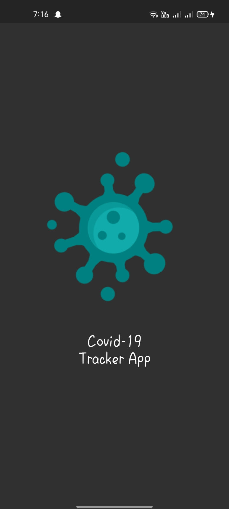
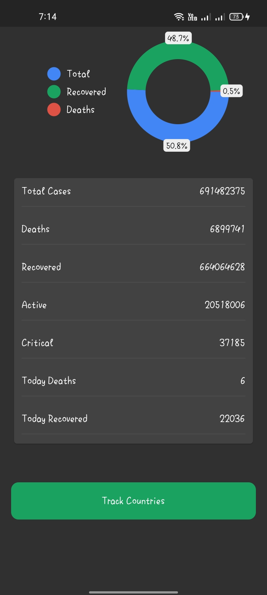
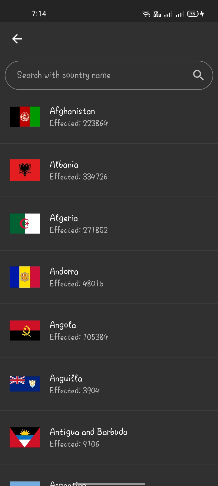
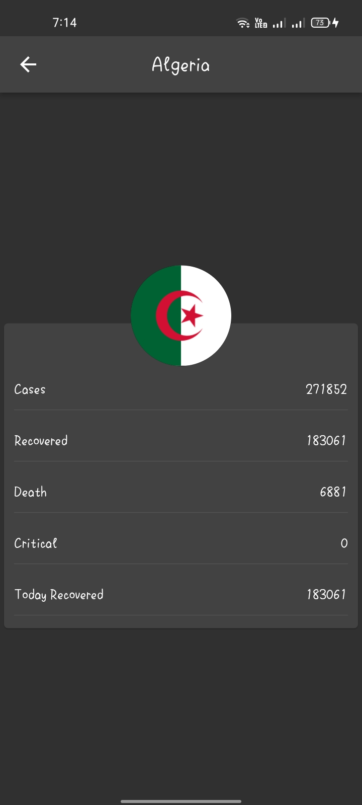

# covid_19_tracker_app_with_flutter

This is a Covid-19 Tracker app developed with flutter and Rest API. The App contains a animated splash Screen and beautifull UI showing the affected countries with count of deaths, affected, recovered and other categories. The figures are get from the "https://disease.sh/v3/covid-19/" This is my first App developed with Rest API.

## 📸 ScreenShots

| 1 | 2|
|------|-------|
|||

| 3 | 4|
|------|-------|
|||

## Getting Started

This project is a starting point for a Flutter application.

A few resources to get you started if this is your first Flutter project:

- [Lab: Write your first Flutter app](https://docs.flutter.dev/get-started/codelab)
- [Cookbook: Useful Flutter samples](https://docs.flutter.dev/cookbook)

For help getting started with Flutter development, view the
[online documentation](https://docs.flutter.dev/), which offers tutorials,
samples, guidance on mobile development, and a full API reference.
